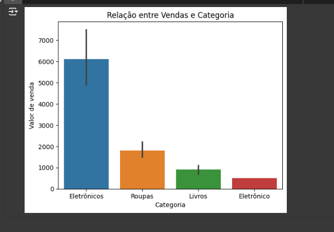

# Projetos e aulas faculdade

## 1. Projeto Analise de dados com SQLite Pandas e Matplotlib

Esse projeto consiste em criar uma base de dados inserindo e trazendo os produtos cadastradas para análise e 
com base nisso, apresentar algumas sugetões para a empresa.

Um projeto bem simples de fazer, não foi necessário fazer tratamento.

Eu agrupei os dados por categoria e fiz a soma de todos os produtos por categoria, para ver qual delas obteve o maior volume de vendas, tendo assim o resultado.

Claro que poderia fazer outra analize, baseado no produto de maior venda, por exemplo, mas achei mais coerente agrupar por categoria e somar.

Para isso utilizei a biblioteca Pandas para me ajudar nesse agrupamento

No final obtive esse gráfico

Onde podemos perceber que os eletrônicos tinham maior volume de venda e roupas foi o segundo maior, livros não teve um bom desempenho.

A quarta categoria foi um erro de digitação, mas deveria ser dos eletrônicos

### 1.1 - Insight

Sobre esse trabalho, foi possível ver que os eletrônicos tiveram a maiores vendas, e uma sugestão apresentada é que a empresa invistisse em mais eletrônicos, assim como as roupas. Que mesmo apresentando um desempenho muito inferior, também foi sugerido que se investisse mais nessa categoria, pois considerando a variabilidade dos preços dos produtos (Um eletônico é mais caro que qualquer peça de roupa), as roupas tiveram um ótimo desempenho